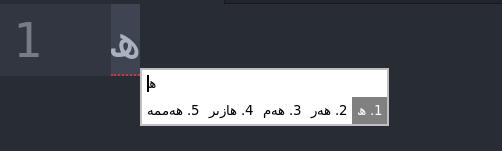
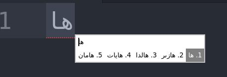
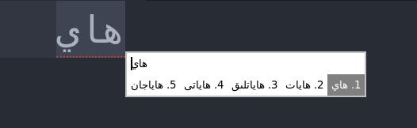
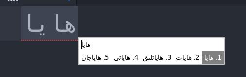

# Uyghur KenLM Fcitx5 Portable

Portable user-local package for the Uyghur KenLM Fcitx5 input method.

<p dir="rtl" align="right">  ئۇيغۇرچە كىرگۈزۈش يۇمشاق دېتالى  </p>

## Install


```sh
sudo apt install fcitx5
wget https://huggingface.co/Rekipjan/Uyghur-Char-KenLM-Input-Method/blob/main/char_trie_q8.bin   data/char_trie_q8.bin
./install.sh
fcitx5 -r -d
```

Then select `Uyghur KenLM` in Fcitx5.

## Custom Dictionary

Edit:

```text
~/.local/share/fcitx5/uyghur-kenlm/dict.txt
```


Use UTF-8 text. One sentence per line or multiple words per line both work.
Restart Fcitx5 after changing the dictionary:

```sh
fcitx5 -r -d
```

## Files Installed

- `~/.local/lib/x86_64-linux-gnu/fcitx5/libuyghurkenlm.so`
- `~/.local/share/fcitx5/addon/uyghurkenlm.conf`
- `~/.local/share/fcitx5/inputmethod/uyghur-kenlm.conf`
- `~/.local/share/fcitx5/uyghur-kenlm/dict.txt`
- `~/.local/share/fcitx5/uyghur-kenlm/char_trie_q8.bin`
- `~/.local/share/fcitx5/themes/uyghur-kenlm`

## Repository Data

GitHub does not accept single files larger than 100 MB in normal Git
repositories. The model file is stored as `data/char_trie_q8.bin.part*`
fragments and `install.sh` combines them automatically during installation.

## Notes

This build targets Linux Mint 21.1 / Ubuntu 22.04 era Fcitx5 packages.

## IMage









